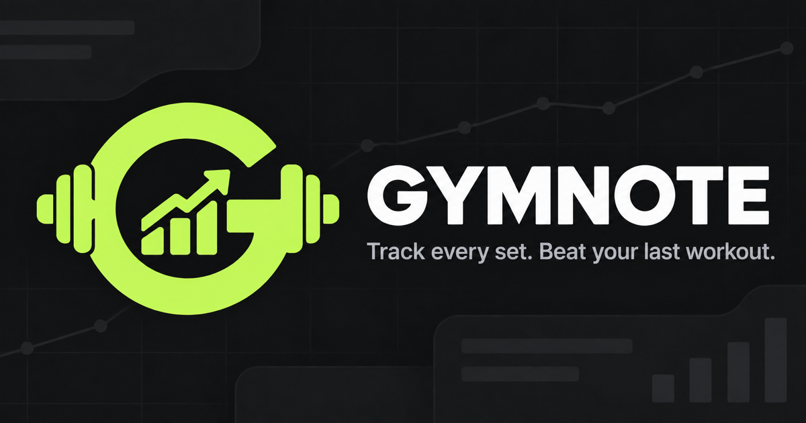

# GYMNOTE

**English** · [Русский](README.ru.md)



> Track every set. Beat your last workout.

GYMNOTE is a workout journal that remembers what you did last time. Start a workout in seconds, record actual weights and reps, or launch a prebuilt training day from an imported program. No account or backend is required, and your data stays in your browser.

**[Try the live demo](https://jenkjs.github.io/gymnote-vue/)**

## Features

- Free-form workouts with manually selected exercises.
- Multi-day training programs.
- Versioned JSON program imports.
- One-click workout creation from a selected program day.
- Planned sets, fixed reps, rep ranges, and timed exercises.
- Add, edit, and soft-delete completed sets.
- Weight-and-reps and duration-based set types.
- Live timer for the active workout.
- Workout history with duration, exercise count, set count, and volume.
- English and Russian UI with a persisted language preference.
- Responsive mobile and desktop interface.
- Local IndexedDB persistence with versioned data migrations.

## Tech stack

| Area | Technology |
| --- | --- |
| UI | Vue 3, Composition API, `<script setup>` |
| Language | TypeScript |
| Build tool | Vite |
| Local database | IndexedDB + Dexie |
| Internationalization | Vue I18n |
| Code quality | ESLint, Oxlint, Prettier, vue-tsc |

## Architecture

The codebase separates UI, application state, domain logic, and infrastructure:

```text
src/
├── components/       Vue UI components
├── composables/      Reactive application use cases
├── domain/           Types, rules, analytics, and transformations
│   ├── exercise/
│   ├── program/
│   └── workout/
├── infrastructure/   Dexie database and repository implementations
├── repositories/     Storage-agnostic contracts
├── locales/          Typed EN/RU translations
├── App.vue
└── main.ts
```

Components never access IndexedDB directly:

```text
Vue component
    ↓
composable
    ↓
repository interface
    ↓
Dexie repository
    ↓
IndexedDB
```

This boundary keeps the UI independent from its persistence mechanism, improves testability, and leaves room for a different storage or sync implementation later.

## Getting started

### Requirements

- Node.js `22.18+` or `24.12+`
- npm

The NVM version is pinned in `.nvmrc`.

```bash
nvm use
npm install
npm run dev
```

Vite will print the local development URL, usually `http://localhost:5173`.

## Available scripts

```bash
npm run dev         # start the development server
npm run type-check  # validate TypeScript and Vue components
npm run lint        # run Oxlint and ESLint with automatic fixes
npm run format      # format source files
npm run build       # type-check and create a production build
npm run preview     # preview the production build
```

Recommended checks before finishing a change:

```bash
npm run type-check
npm run lint
npm run build
```

## Importing a training program

Select **Import program** in the app and choose a GYMNOTE JSON file.

A ready-to-use three-day example is included:

- [`public/examples/my-three-day-gym-program.json`](public/examples/my-three-day-gym-program.json)

Minimal file structure:

```json
{
  "format": "gymnote-training-programs",
  "version": 1,
  "programs": [
    {
      "name": "Three-day program",
      "days": [
        {
          "name": "Day 1",
          "exercises": [
            {
              "exerciseId": "system:bench-press",
              "targetSets": 4,
              "targetRepetitionsMin": 8,
              "targetRepetitionsMax": 10,
              "targetDurationSeconds": null
            }
          ]
        }
      ]
    }
  ]
}
```

For a duration-based exercise, both repetition fields must be `null`:

```json
{
  "exerciseId": "system:plank",
  "targetSets": 3,
  "targetRepetitionsMin": null,
  "targetRepetitionsMax": null,
  "targetDurationSeconds": 40
}
```

Imported data is treated as untrusted and validated at runtime. GYMNOTE checks the file format, version, structure, numeric constraints, and exercise IDs. Internal UUIDs and timestamps are generated by the app, so an imported file cannot overwrite them directly.

## Persistence and migrations

Workouts and programs are stored locally in IndexedDB. Dexie manages schema versions and upgrades for existing records.

Current migrations preserve older workouts when the domain model evolves, including the addition of set measurement types and workout sources. TypeScript types disappear at runtime and cannot update existing browser data, which is why explicit migrations are part of the persistence design.

## Design principles

- **Local-first:** core workflows do not require a backend.
- **Mobile-first:** the UI is designed primarily for quick use in the gym.
- **Plan versus actual:** a program stores the prescription; a workout stores completed work.
- **Historical snapshots:** workout history keeps the program and day names as they were when the workout started.
- **Recoverable deletion:** sets are soft-deleted through `deletedAt`.
- **Untrusted input:** external files are validated before reaching persistence.

## Roadmap

- [x] Free-form workouts and set tracking
- [x] Local history and basic analytics
- [x] EN/RU localization
- [x] Versioned training program imports
- [x] Start a workout from a program day
- [ ] Detailed exercise preview inside program cards
- [ ] Custom program and exercise editor
- [ ] Warm-up, finisher, and workout notes
- [ ] Advanced analytics and personal records
- [ ] Installable offline PWA
- [ ] Unit and component test suites
- [ ] Data export and backup

## Project status

GYMNOTE is under active development. The core local-first workout flow is functional, while the data format and UI may continue to evolve before the first stable release.
